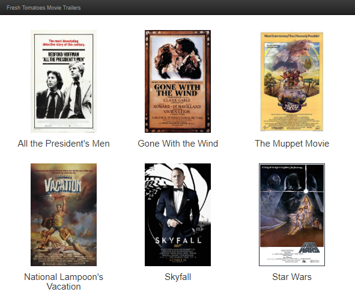

# A movie trailer website in Python

This project builds a website that shows poster art and previews for some of my favorite movies.

Code is written for Python 2.7. 

Note: `fresh_tomatoes.py` is from https://github.com/udacity/ud036_StarterCode.

## To view the website

1. Download or clone this repository.
2. Open the `entertainment_center.py` file in Python IDLE.
3. Click `Run > Run Module`. 
4. If successful, your system's default browser should open and display the website. Click any of the poster images to play a video of the movie's trailer from YouTube.

